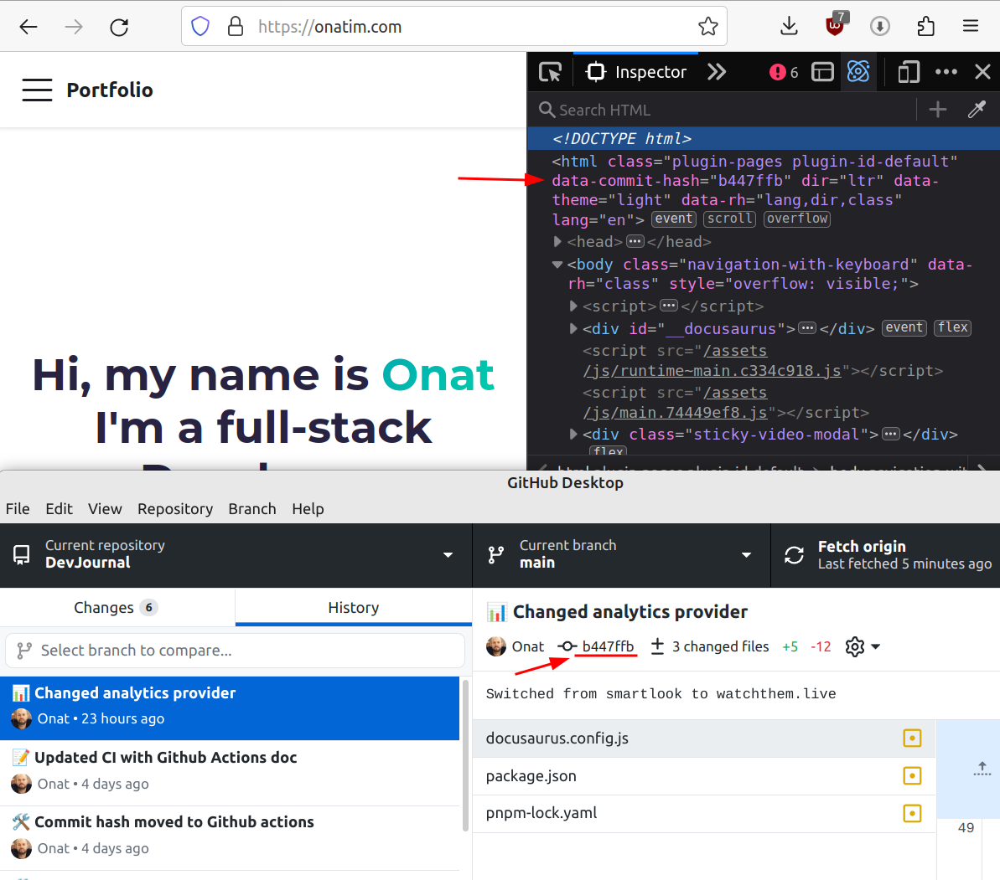

# Add git commit hash to your website

You updated your site, committed and pushed. Continious integration picked up and will soon deploy. Now is the time for endless refreshes. You are not even sure if changes are in place because the latest change didn't have any visual changes. How can you tell if the latest commit is published? Well, why not put the latest commit hash in the `<html>` tag? It is very simple with Github Actions. Below is the snippet of the deployment yaml.

## YAML

```yaml {22,23,25,26} title="deploy.yml"
name: Deploy to GitHub Pages

on:
    push:
        branches:
            - main
jobs:
    deploy:
        name: Deploy to GitHub Pages
        runs-on: ubuntu-latest
        steps:
            - uses: actions/checkout@v3
            - uses: pnpm/action-setup@v2.2.4
              with:
                  version: 7

            - name: 🗜️ Install dependencies
              run: pnpm install
            - name: 🏗 Build website
              run: pnpm run build

            - name: 💾 Store commit hash as an enviromment variable
              run: echo "COMMIT_HASH=$(echo ${{ github.sha }} | cut -c 1-7)" >> $GITHUB_ENV

            - name: 🗃 Add commit hash to <html> tag in index.html
              run: sed -i 's/<html /<html data-commit-hash="'"$COMMIT_HASH"'" /' ./build/index.html

            - name: Deploy to GitHub Pages
              uses: peaceiris/actions-gh-pages@v3
              with:
                  github_token: ${{ secrets.GITHUB_TOKEN }}
                  publish_dir: ./build
                  user_name: ${{ github.event.pusher.name }}
                  user_email: ${{ github.event.pusher.email }}
```

## Screenshot


