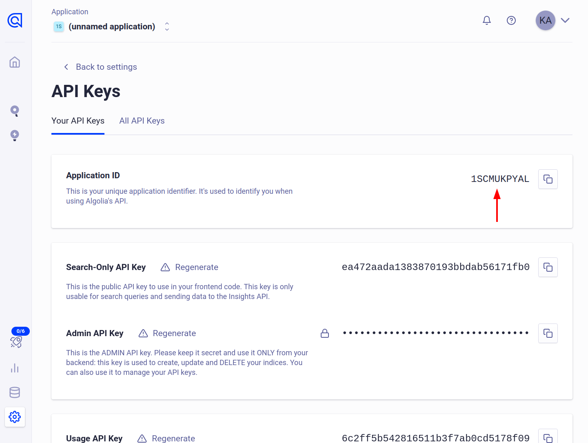
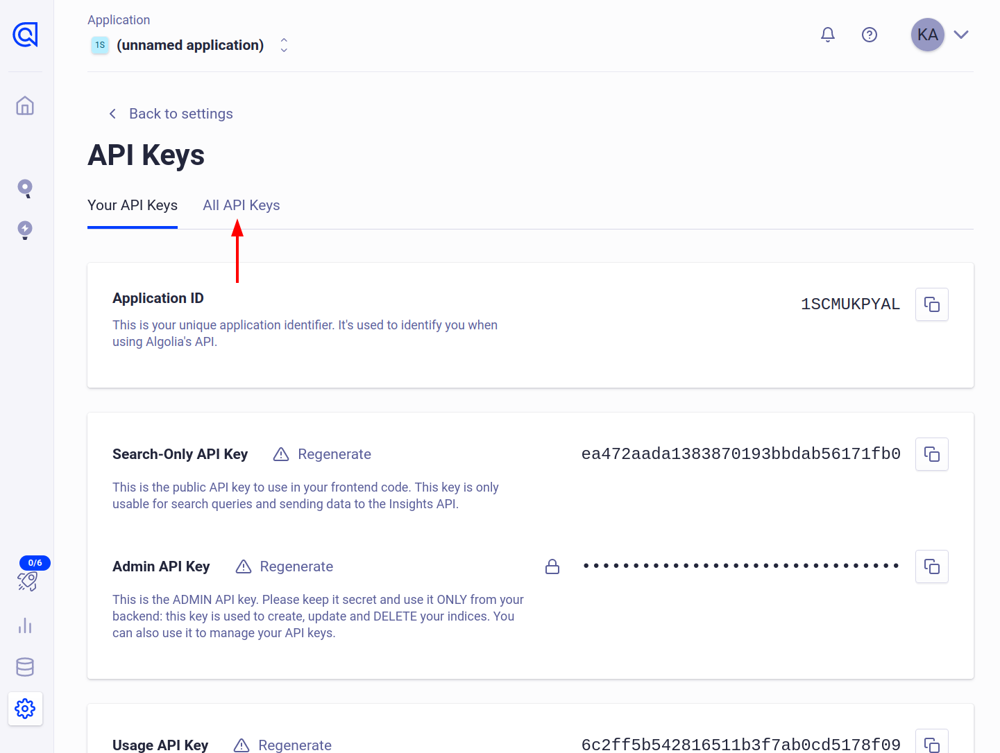
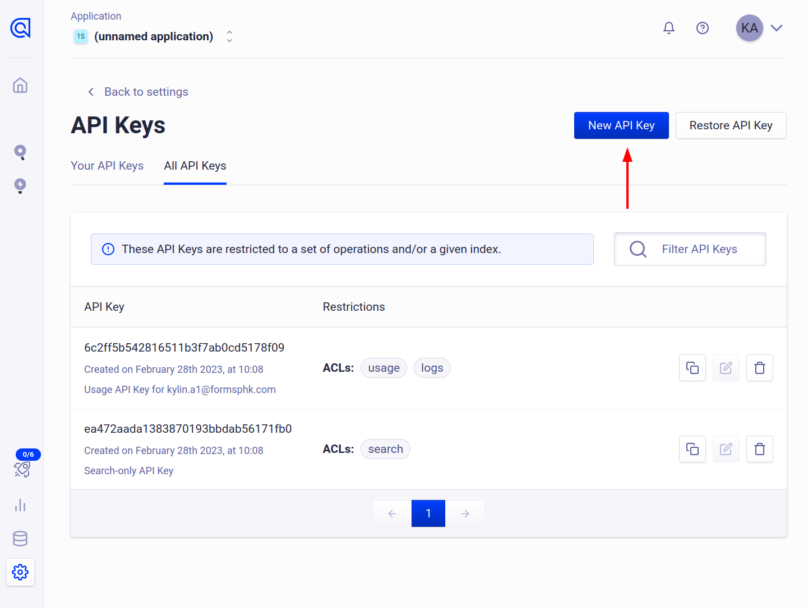
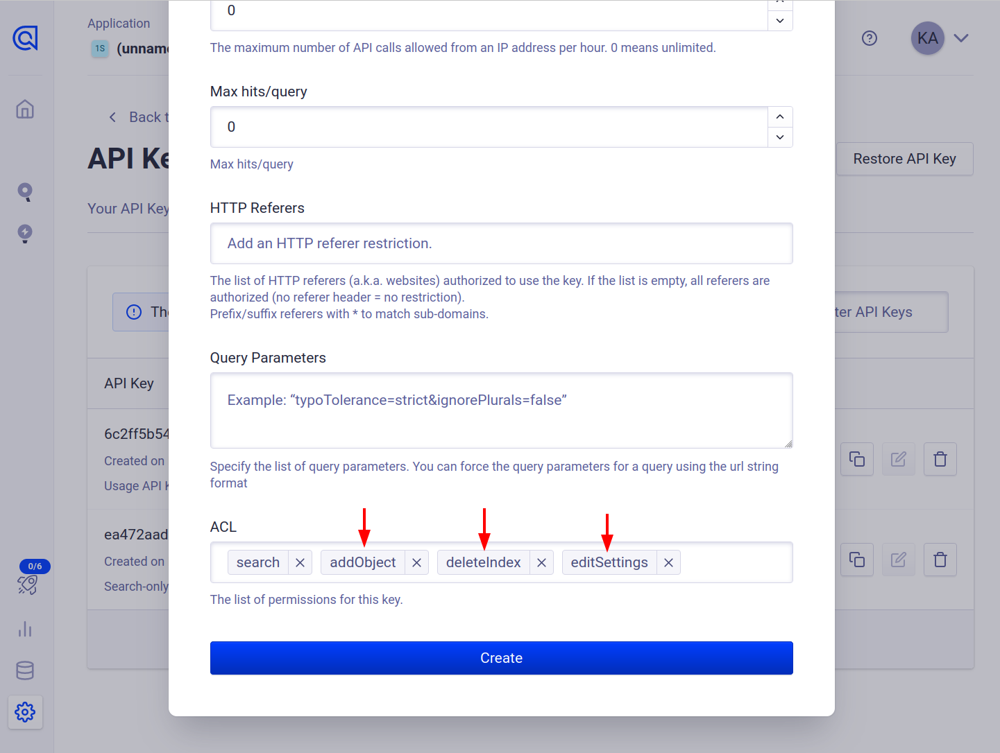
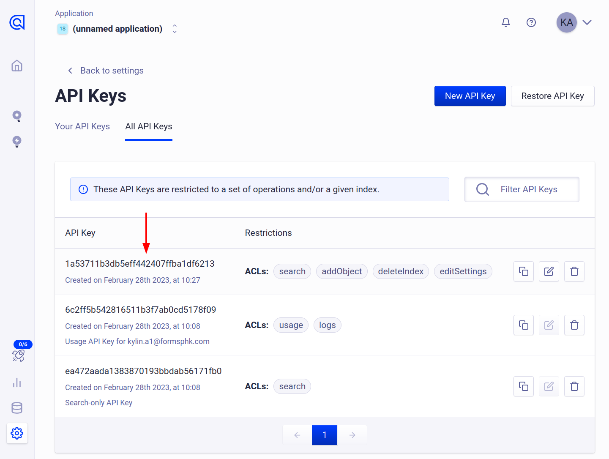
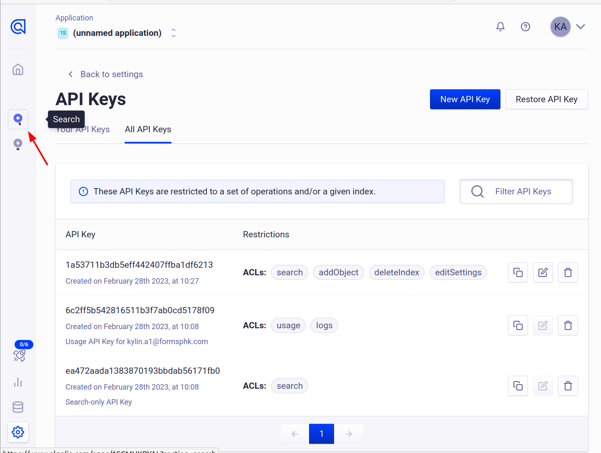
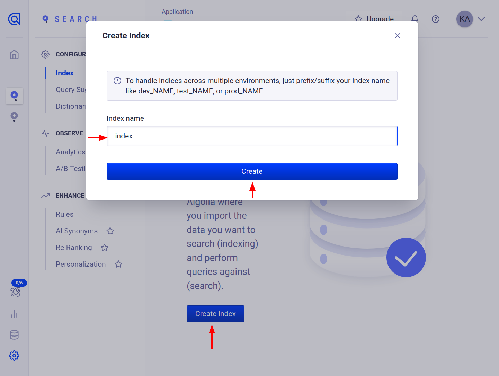
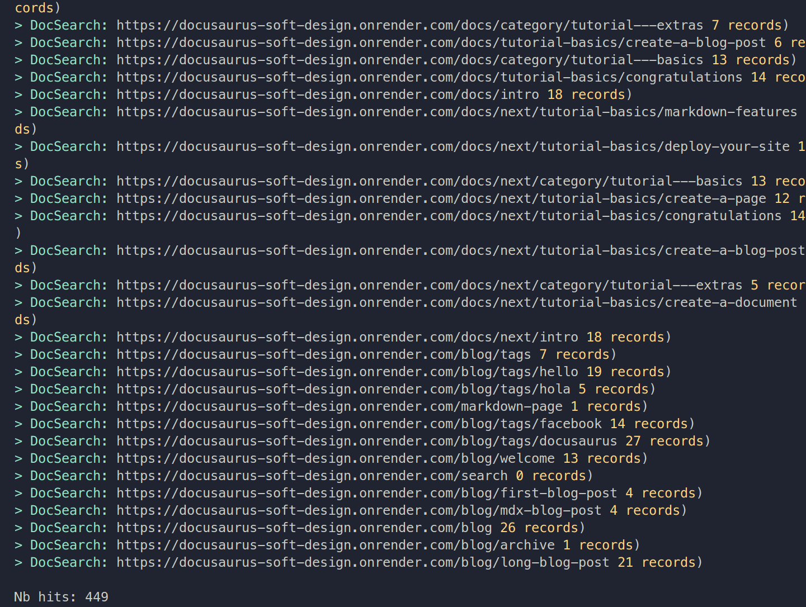

# Algolia setup

### Algolia dashboard settings

-   Sign up for an account with [Algolia](https://www.algolia.com/users/sign_up)
-   Go to [dashboard](https://www.algolia.com/dashboard)
-   Click on API Keys 
-   Make note of the Application ID, we will need it 
-   Click on All API Keys 
-   Click on New API Key 
-   Scroll to the bottom and add `addObject`, `deleteIndex` and `editSettings` to the ACL list
    and click on `Create` 
-   Make note of the API Key, we will need it 
-   Now we need to create an index, click on search 
-   Click on create index, give it the name index and click create 
-   We are done with Algolia dashboard settings 🎉️

### Docusaurus settings

Install Algolia plugin

```bash
pnpm add @docusaurus/theme-search-algolia
```

Add below snippet with your credentials we noted above inside the themeConfig object

```js title="./docusaurus.config.js"
algolia: {
    appId: "your_app_id",
    apiKey: "your_api_key",
    indexName: 'index',
    contextualSearch: true,
    searchParameters: {},
},
```

Make a file in the root directory called `config.json` and paste the below code in it. Replace the address with your own at the highlighted line. Leave `/sitemap.xml` at the end. `start_url` is needed if docs are at the top level of your site `www.example.com`. It may not be needed if docs are at `docs.example.com`

```json {3,4} title="./config.json"
{
    "index_name": "index",
    "sitemap_urls": ["https://your_website.com/sitemap.xml"],
    "start_urls": ["https://your_website.com"], // May not be needed, check above
    "sitemap_alternate_links": true,
    "selectors": {
        "lvl0": {
            "selector": "(//ul[contains(@class,'menu__list')]//a[contains(@class, 'menu__link menu__link--sublist menu__link--active')]/text() | //nav[contains(@class, 'navbar')]//a[contains(@class, 'navbar__link--active')]/text())[last()]",
            "type": "xpath",
            "global": true,
            "default_value": "Documentation"
        },
        "lvl1": "header h1",
        "lvl2": "article h2",
        "lvl3": "article h3",
        "lvl4": "article h4",
        "lvl5": "article h5, article td:first-child",
        "lvl6": "article h6",
        "text": "article p, article li, article td:last-child"
    },
    "strip_chars": " .,;:#",
    "custom_settings": {
        "separatorsToIndex": "_",
        "attributesForFaceting": ["language", "version", "type", "docusaurus_tag"],
        "attributesToRetrieve": ["hierarchy", "content", "anchor", "url", "url_without_anchor", "type"]
    },
    "conversation_id": ["833762294"],
    "nb_hits": 46250
}
```

Also make a `.env` file at the root level of your project if you already don't have one and add your credentials in it. Variables need to be named exactly as in the example with no spaces.

<!-- prettier-ignore -->
```js title="./.env"
ALGOLIA_APP_ID=your_app_id
ALGOLIA_API_KEY=your_app_key
```

We need install a small dependency called jq. Get it [here](https://stedolan.github.io/jq/download/)

Install docker from [here](https://www.docker.com/)

Finally, run the below command in a terminal at the path of your project root and you should now have an index! 🎉️

```bash
docker run -it --env-file=.env -e "CONFIG=$(cat ./config.json | jq -r tostring)" algolia/docsearch-scraper
```

Here's what the output should look like 

### Add to navbar

Make sure to add search to navbar items list.

```js {19-22} title="./docusaurus.config.js"
navbar: {
    title: "Portfolio",
    logo: {
        alt: "My Site Logo",
        src: "img/logo.svg",
    },
    items: [
        {
            type: "docSidebar",
            sidebarId: "tutorialSidebar",
            position: "left",
            label: "Tutorials",
        },
        {
            to: "/blog",
            label: "Blog",
            position: "left",
        },
        {
            type: "search",
            position: "right",
        },
        {
            href: "https://github.com/onattech",
            label: "GitHub",
            position: "right",
        },
    ],
}
```

### Deploy with Github Actions

Make an `algolia.yml` file in `.github/workflows/` folder any copy the contents below.

```yml title='./.github/workflows/algolia.yml'
name: Algolia Indexing

on:
    workflow_run:
        workflows: ["pages-build-deployment"]
        types:
            - completed

jobs:
    algolia-index:
        runs-on: ubuntu-latest

        steps:
            - name: Checkout code
              uses: actions/checkout@v2

            - name: Install JQ
              run: sudo apt-get install -y jq

            - name: Run Algolia Scraper
              run: |
                  docker run --env-file=.env -e "CONFIG=$(cat ./config.json | jq -r tostring)" algolia/docsearch-scraper
```
