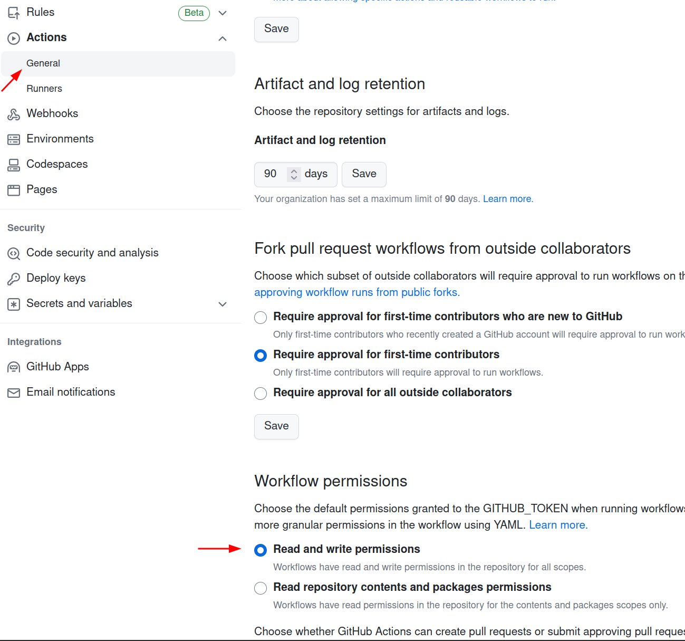

# Deployment to Github Pages with Github Actions

Below is a workflow YAML to deploy a Docusaurus site with pnpm to GitHub Pages via GitHub Actions. An action to deploy will be triggered on each push to the main branch.

### Steps to follow

1. Add the YAML file to the project directory.
2. Setup a token on Github.
3. Make a push to the main branch.

```yaml title="./.github/workflows/deploy.yml"
name: Deploy to GitHub Pages

on:
    push:
        branches:
            - main
        # Review gh actions docs if you want to further define triggers, paths, etc
        # https://docs.github.com/en/actions/using-workflows/workflow-syntax-for-github-actions#on
#
jobs:
    deploy:
        name: Deploy to GitHub Pages
        runs-on: ubuntu-latest
        steps:
            - uses: actions/checkout@v3
            - uses: pnpm/action-setup@v2.2.4
              with:
                  version: 7

            - name: 📦 Cache pnpm and node_modules
              uses: actions/cache@v3
              with:
                  path: |
                      ~/.pnpm-store
                      node_modules
                  key: pnpm-${{ hashFiles('**/pnpm-lock.yaml') }}
                  restore-keys: pnpm-

            - name: 🗜️ Install dependencies
              run: pnpm install --no-frozen-lockfile
            - name: 🏗 Build website
              run: pnpm run build

            # Optional
            - name: ️🏷 Add commit hash to <html> tag
              run: |
                  COMMIT_HASH=$(echo ${{ github.sha }} | cut -c 1-7)
                  sed -i 's/<html /<html data-commit-hash="'"$COMMIT_HASH"'" /' ./build/index.html

            # Popular action to deploy to GitHub Pages:
            # Docs: https://github.com/peaceiris/actions-gh-pages#%EF%B8%8F-docusaurus
            - name: Deploy to GitHub Pages
              uses: peaceiris/actions-gh-pages@v3
              with:
                  github_token: ${{ secrets.GITHUB_TOKEN }}
                  # Build output to publish to the `gh-pages` branch:
                  publish_dir: ./build
                  # The following lines assign commit authorship to the official
                  # GH-Actions bot for deploys to `gh-pages` branch:
                  # https://github.com/actions/checkout/issues/13#issuecomment-724415212
                  # The GH actions bot is used by default if you didn't specify the two fields.
                  # You can swap them out with your own user credentials.
                  user_name: ${{ github.event.pusher.name }}
                  user_email: ${{ github.event.pusher.email }}
# Give permission to workflow => https://stackoverflow.com/a/75308228
```

### Set workflow permissions

Github actions needs permissions to commit to the repository. You may give necessary permission by going to `Settings -> Actions -> General -> Workflow permissions` and selecting `Read and write permissions`


