# GO doc tutorial

:::info
Here are my examples to what is possible with Go Doc syntax explained [here](https://tip.golang.org/doc/comment).
:::

## Quotes

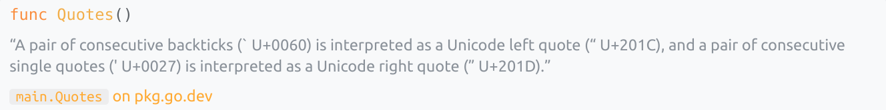

```go
// “A pair of consecutive backticks (` U+0060) is interpreted as a Unicode left quote (“ U+201C),
// and a pair of consecutive single quotes (' U+0027) is interpreted as a Unicode right quote (” U+201D).”
func Quotes() {}
```

## Headings

<Resizer percent={60}>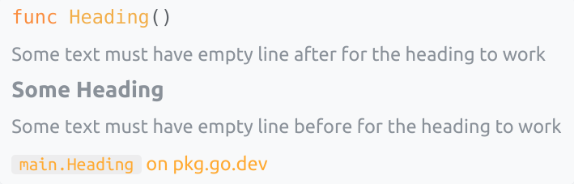</Resizer>

```go
// Some text must have empty line after for the heading to work
//
// # Some Heading
//
// Some text must have empty line before for the heading to work
func Heading() {}
```

## Links

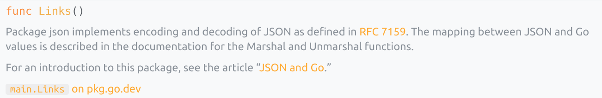

```go
// Package json implements encoding and decoding of JSON as defined in
// [RFC 7159]. The mapping between JSON and Go values is described
// in the documentation for the Marshal and Unmarshal functions.
//
// For an introduction to this package, see the article
// “[JSON and Go].”
//
// [RFC 7159]: https://tools.ietf.org/html/rfc7159
// [JSON and Go]: https://golang.org/doc/articles/json_and_go.html
func Links() {}
```

## Doc Links

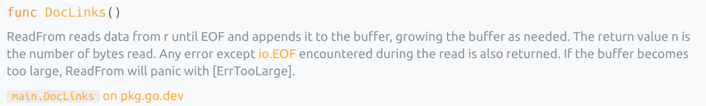

```go
// ReadFrom reads data from r until EOF and appends it to the buffer, growing
// the buffer as needed. The return value n is the number of bytes read. Any
// error except [io.EOF] encountered during the read is also returned. If the
// buffer becomes too large, ReadFrom will panic with [ErrTooLarge].
func DocLinks() {}
```

## Lists

<Resizer percent={80}>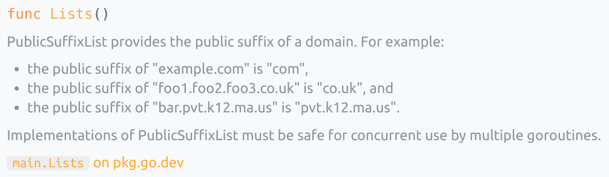</Resizer>

```go
// PublicSuffixList provides the public suffix of a domain. For example:
//   - the public suffix of "example.com" is "com",
//   - the public suffix of "foo1.foo2.foo3.co.uk" is "co.uk", and
//   - the public suffix of "bar.pvt.k12.ma.us" is "pvt.k12.ma.us".
//
// Implementations of PublicSuffixList must be safe for concurrent use by
// multiple goroutines.
func Lists() {}
```

## Numbered Lists

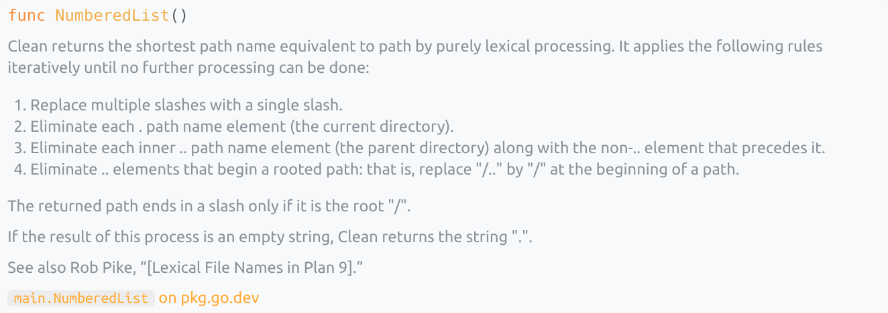

```go
// Clean returns the shortest path name equivalent to path
// by purely lexical processing. It applies the following rules
// iteratively until no further processing can be done:
//
//  1. Replace multiple slashes with a single slash.
//  2. Eliminate each . path name element (the current directory).
//  3. Eliminate each inner .. path name element (the parent directory)
//     along with the non-.. element that precedes it.
//  4. Eliminate .. elements that begin a rooted path:
//     that is, replace "/.." by "/" at the beginning of a path.
//
// The returned path ends in a slash only if it is the root "/".
//
// If the result of this process is an empty string, Clean
// returns the string ".".
//
// See also Rob Pike, “[Lexical File Names in Plan 9].”
func NumberedList() {}
```

## Lists with Sub Items

<Resizer percent={40}>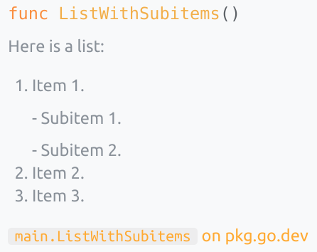</Resizer>

```go
// Here is a list:
//
//  1. Item 1.
//
//     - Subitem 1.
//
//     - Subitem 2.
//
//  2. Item 2.
//
//  3. Item 3.
func ListWithSubitems() {}
```

## Code Blocks

<Resizer percent={60}>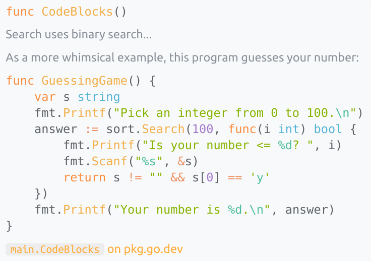</Resizer>

```go
// Search uses binary search...
//
// As a more whimsical example, this program guesses your number:
//
//	func GuessingGame() {
//	    var s string
//	    fmt.Printf("Pick an integer from 0 to 100.\n")
//	    answer := sort.Search(100, func(i int) bool {
//	        fmt.Printf("Is your number <= %d? ", i)
//	        fmt.Scanf("%s", &s)
//	        return s != "" && s[0] == 'y'
//	    })
//	    fmt.Printf("Your number is %d.\n", answer)
//	}
func CodeBlocks() {}
```

## Code blocks 2

<Resizer percent={30}>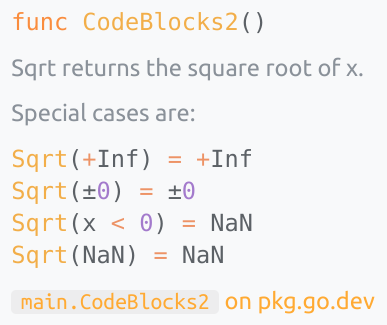</Resizer>

```go
// Sqrt returns the square root of x.
//
// Special cases are:
//
//	Sqrt(+Inf) = +Inf
//	Sqrt(±0) = ±0
//	Sqrt(x < 0) = NaN
//	Sqrt(NaN) = NaN
func CodeBlocks2() {}
```

## Preformatted text

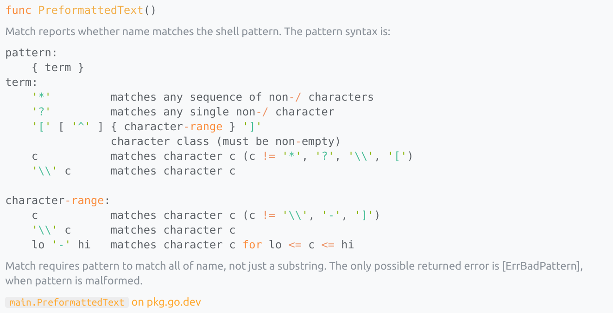

```go
// Match reports whether name matches the shell pattern.
// The pattern syntax is:
//
//	pattern:
//	    { term }
//	term:
//	    '*'         matches any sequence of non-/ characters
//	    '?'         matches any single non-/ character
//	    '[' [ '^' ] { character-range } ']'
//	                character class (must be non-empty)
//	    c           matches character c (c != '*', '?', '\\', '[')
//	    '\\' c      matches character c
//
//	character-range:
//	    c           matches character c (c != '\\', '-', ']')
//	    '\\' c      matches character c
//	    lo '-' hi   matches character c for lo <= c <= hi
//
// Match requires pattern to match all of name, not just a substring.
// The only possible returned error is [ErrBadPattern], when pattern
// is malformed.
func PreformattedText() {}
```

## Pretty JSON

<Resizer percent={35}>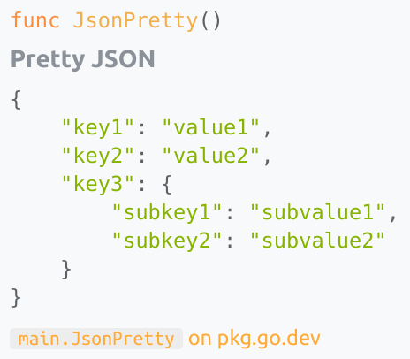</Resizer>

```go
/*
# Pretty JSON

	{
		"key1": "value1",
		"key2": "value2",
		"key3": {
		    "subkey1": "subvalue1",
		    "subkey2": "subvalue2"
		}
	}
*/
func JsonPretty() {}
```

## Example function flow

<Resizer percent={40}>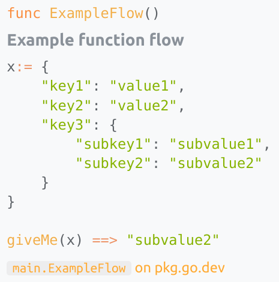</Resizer>

```go
/*
# Example function flow

	x:= {
	    "key1": "value1",
	    "key2": "value2",
	    "key3": {
	        "subkey1": "subvalue1",
	        "subkey2": "subvalue2"
	    }
	}

	giveMe(x) ==> "subvalue2"
*/
func ExampleFlows() {}
```
